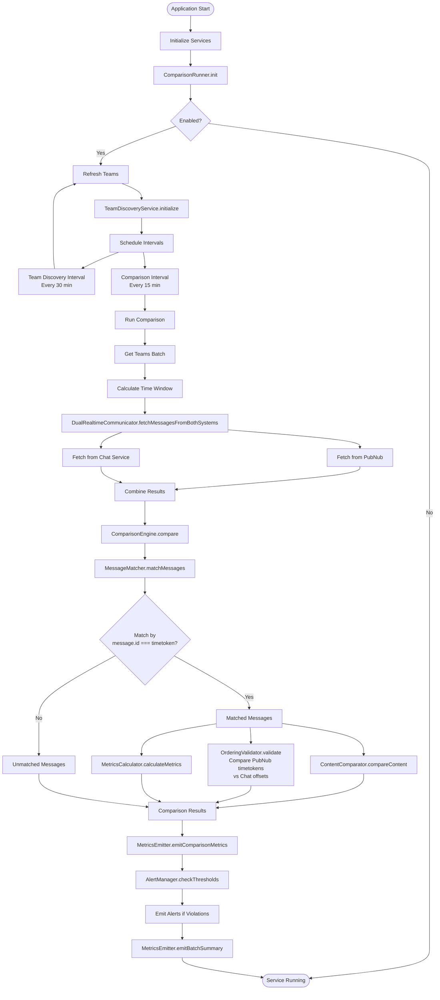
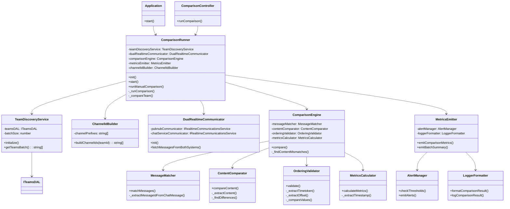

# Chat Comparison Service

Standalone microservice that validates Chat behavior against PubNub during migration by periodically comparing messages from both systems.

## Overview

This service enables side-by-side validation of Chat against PubNub during Teams chat migration. It fetches messages from both systems, correlates them, and performs comprehensive validation without modifying the Teams service.

## Architecture

The service consists of the following modules:

- **Team Discovery**: Discovers teams to monitor using TeamsDAL
- **Dual Realtime Communicator**: Fetches messages from both PubNub and Chat Service using RTC package
- **Message Matcher**: Correlates messages by matching PubNub timetoken with Chat Service message ID (extracted from `message.id`)
- **Comparison Engine**: Validates message count, content, ordering, coverage, and latency
- **Metrics & Alerting**: Emits metrics and triggers alerts based on thresholds

### Main Flow



### Class Dependencies



## Key Features

- **Zero Teams Service Changes**: Operates independently without requiring Teams service modifications
- **Dual-System Comparison**: Fetches from both PubNub and Chat in parallel
- **Comprehensive Validation**: Compares all dimensions (count, content, ordering, coverage, latency)
- **Configurable Scope**: Supports manual team selection or automatic discovery
- **Threshold-Based Alerting**: Emits metrics and triggers alerts on discrepancies
- **On-Demand API**: REST API endpoint for manual comparison runs

## API Endpoints

### POST `/api/v1/comparison/run`

Triggers an on-demand comparison for specified teams or all cached teams.

**Request Body (optional):**
```json
{
  "teamIds": ["team-id-1", "team-id-2"],
  "channelIds": ["channel-id-1", "channel-id-2"]
}
```

**Response:**
```json
{
  "success": true,
  "teamCount": 2,
  "comparisonCount": 2,
  "results": [
    {
      "teamId": "team-id-1",
      "channelId": "channel-id-1",
      "metrics": { ... }
    }
  ]
}
```

**Example:**
```bash
curl -X POST http://localhost:3000/api/v1/comparison/run \
  -H "Content-Type: application/json" \
  -d '{"teamIds": ["team-id-1", "team-id-2"]}'
```

If no `teamIds` are provided, the comparison runs for all cached teams.

## Configuration

The service is configured via feature flags:

```json
{
  "chat-comparison-config": {
    "enabled": true,
    "team_discovery_interval_minutes": 30,
    "polling_interval_minutes": 15,
    "polling_time_window_minutes": 20,
    "batch_size": 50,
    "max_messages_per_fetch": 100,
    "team_ids_override": []
  },
  "chat-comparison-thresholds": {
    "message_count_discrepancy_percent": 5,
    "message_count_discrepancy_absolute": 10,
    "content_mismatch_rate_percent": 1,
    "ordering_violations_count": 0,
    "coverage_percentage_min": 90,
    "latency_diff_ms_max": 5000,
    "api_failure_rate_percent": 5
  }
}
```

## Metrics

The service emits the following metrics:

- `chat_comparison.message_count_discrepancy` - Absolute difference in message counts
- `chat_comparison.content_mismatch_rate` - Percentage of content mismatches
- `chat_comparison.ordering_violations` - Count of ordering differences
- `chat_comparison.coverage_percentage` - Coverage of Chat vs PubNub messages
- `chat_comparison.latency_diff_ms` - Latency difference between systems
- `chat_comparison.chat_missing_messages` - Messages in PubNub but not Chat
- `chat_comparison.pubnub_missing_messages` - Messages in Chat but not PubNub (CRITICAL)
- `chat_comparison.comparison_run_duration_ms` - Duration of scheduled comparison runs
- `chat_comparison.scheduled_comparison_failures` - Count of failed scheduled comparisons
- `chat_comparison.scheduled_team_discovery_failures` - Count of failed team discovery runs
- `chat_comparison.comparison_failures` - Count of individual team comparison failures

## Running Locally

```bash
npm install
AWS_PROFILE=moonactive-ci npm start
```

## Testing

```bash
npm test
npm run test:integration
```

## Deployment

The service is deployed as a Kubernetes consumer service. See `k8s/deployment.yaml` for configuration.
